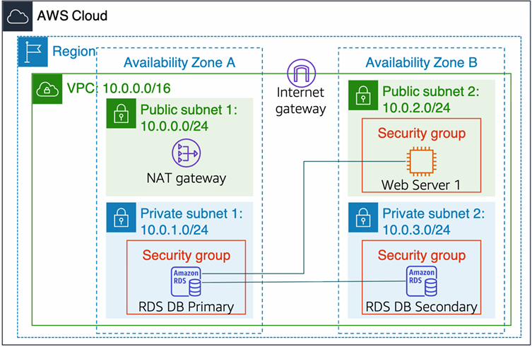
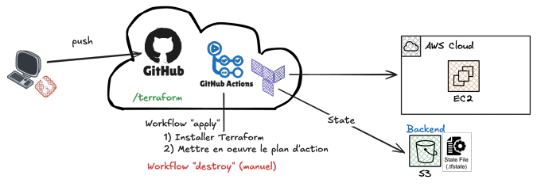

# Automated Cloud Infrastructure with Terraform and GitHub Actions

## Base project

### Architecture



### To do

- [x] VPC (Subnets, availability zones)
- [x] Internet Gateway
- [x] Nat Gateway
- [x] Web server (create, sg, user data)
- [x] Route table to internet
- [x] Route table private subnet to nat gateway
- [x] RDS Primary (create and sg)
- [ ] RDS Secondary (Not possible with student account)

## Automation Part

### Architecture



### Workflow GitHub Actions

- [x] Workflow to create all resources from Terraform configuration -> [terraform-apply.yml](.github/workflows/terraform-apply.yml)
- [x] Workflow to destroy all resources from Terraform state -> [terraform-destroy.yml](.github/workflows/terraform-destroy.yml)
- [x] Terraform state is stored centrally in an S3 bucket

## Secrets to define

Create GitHub Secrets (`Settings -> Secrets and variables -> Actions -> New repository secret`)

- AWS Credentials (in AWS details)
  - AWS_ACCESS_KEY_ID
  - AWS_REGION
  - AWS_SECRET_ACCESS_KEY
  - AWS_SESSION_TOKEN

- AWS RDS DB (you can choose)
  - DB_PASSWORD
  - DB_USERNAME
  
- AWS SSH key for ec2 instance Web server
  - Generate SSH key: `ssh-keygen -t rsa -b 4096 -f web-server-key`
  - SSH_PUBLIC_KEY -> copy from web-server-key file

- AWS S3 BUCKET (you can choose)
  - S3_BACKEND_BUCKET

## Project Structure

```bash
.
├── .github
│   └── workflows
│       ├── terraform-apply.yml
│       └── terraform-destroy.yml
├── data.tf
├── main.tf
├── outputs.tf
├── terraform.tfvars
└── variables.tf
```

- terraform-apply.yml: Workflow that automatically applies Terraform configuration and creates all AWS resources
- terraform-destroy.yml: Workflow that automatically destroys all AWS resources managed by Terraform state
- data.tf: defines data sources used by Terraform (AMIs)
- main.tf: declares primary resources (networking, instances, SGs, routes)
- outputs.tf: exposes outputs printed after running `terraform apply`(Subnets and VPC IDs and clickable link to web server)
- variables.tf: declares input variables (types, default values)
- terraform.tfvars: provides concrete values for variables (CIDRs, sizes, names)
- terraform.tfstate: Terraform state (Do not modify)

### SSH

- `ssh -i web-server-key ec2-user@<Public_DNS>`
